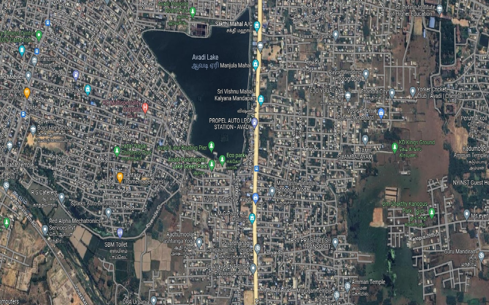
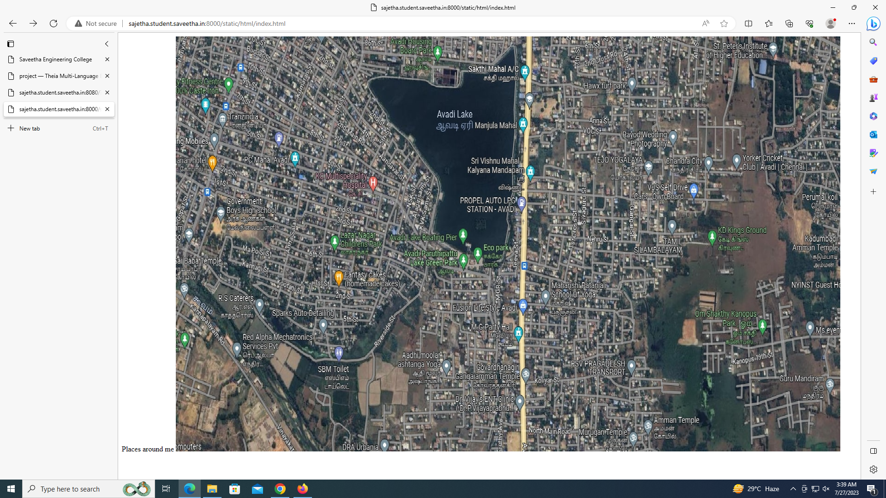
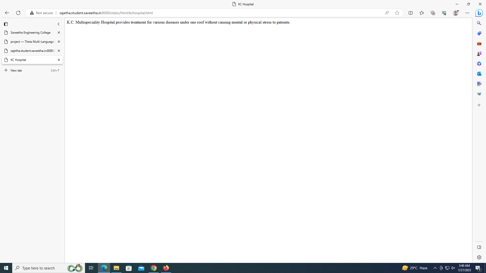
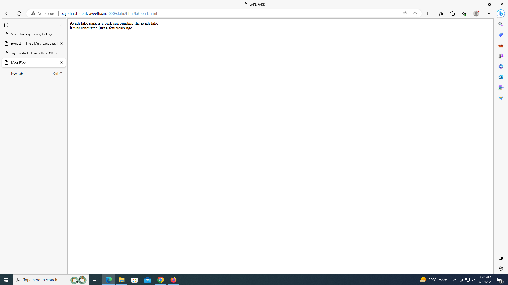
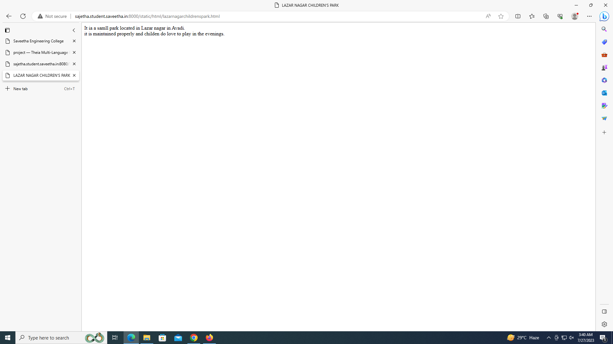
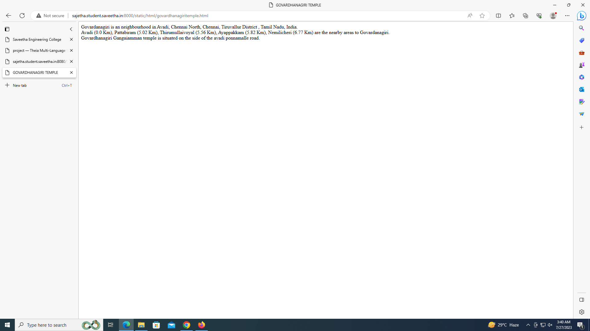
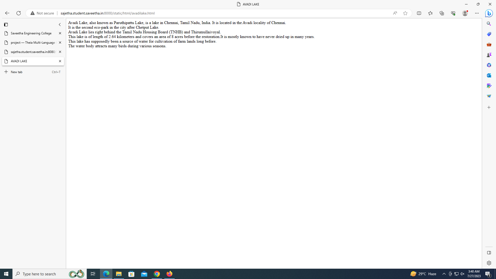

# Places Around Me
## AIM:
To develop a website to display details about the places around my house.

## Design Steps:

### Step 1:
Create a folder and clone the repository into the folder.
### Step 2:
Start a project named myproj and create an app inside it.
### Step 3:
Do the required changes in settings.py
### Step 4:
Open google maps and take a screenshot of a place near your house, then open image map and create a html page for some places around your place then get the code and complete index.html in static files 
### Step 5:
Then create a html file for each of the places that you have selected
### Step 6:
Run the server and check if the web pages are loding perfectly
### Step 7:
Then reposit the same to github using the git commands. 
## Code:

### index.html:
```
<!DOCTYPE html>
<html>
    <titile>Places around me</titile>
    <body>
        
        <map name="image-maps-2023-07-25-054119" id="ImageMapsCom-image-maps-2023-07-25-054119">
        <area  alt="" title="KC Hospital" href="kchospital.html" shape="rect" coords="389,314,439,364" style="outline:none;" target="_self"     />
        <area  alt="" title="Avadi Lake Park" href="lakepark.html" shape="rect" coords="598,483,648,533" style="outline:none;" target="_self"     />
        <area  alt="" title="Lazar Nagar Children's Park" href="lazarnagarchildrenspark.html" shape="rect" coords="331,439,381,489" style="outline:none;" target="_self"     />
        <area  alt="" title="Govardhanagiri Gangaiamman Temple" href="govardhanagiritemple.html" shape="rect" coords="734,733,789,787" style="outline:none;" target="_self"     />
        <area shape="rect" coords="1438,898,1440,900" alt="Image Map" style="outline:none;" title="Image Map" href="https://www.image-maps.com/" />
        <area  alt="" title="Avadi Lake" href="avadilake.html" shape="poly" coords="735,22,708,470,557,420,558,293,507,221,456,163,428,118,417,100,421,89,606,111" style="outline:none;" target="_self"     />
        </map>
    </body>
</html>
```
### kchospital.html:
```html
<!DOCTYPE html>
<html>
    <title>
        KC Hospital
    </title>
    <body>
        K.C. Multispeciality Hospital provides treatment for various diseases under one roof without causing mental or physical stress to patients. 
    </body>
</html>
```

### lakepark.html:
```html
<!DOCTYPE html>
<html>
    <title>
        LAKE PARK
    </title>
    <BODY>
        Avadi lake park is a park surrounding the avadi lake<br>
        it was renovated just a few years ago<br> 
    </BODY>
</html>
```

### lazarnagarchildrenspark.html:
```html
<!DOCTYPE html>
<html>
    <title>
        LAZAR NAGAR CHILDREN'S PARK
    </title>
    <BODY>
        It ia a samll park located in Lazar nagar in Avadi.<br>
        it is maintained properly and childen do love to play in the evenings.<br>
    </BODY>
</html>
```

### govardhanagiritemple.html:
```html
<!DOCTYPE html>
<html>
    <title>GOVARDHANAGIRI TEMPLE</title>
    <body>
        Govardanagiri is an neighbourhood in Avadi, Chennai North, Chennai, Tiruvallur District , Tamil Nadu, India.<br>

        Avadi (0.0 Km), Pattabiram (5.02 Km), Thirumullaivoyal (5.56 Km), Ayappakkam (5.82 Km), Nemilicheri (6.77 Km) are the nearby areas to Govardanagiri.<br>
        Govardhanagiri Gangaiamman temple is situated on the side of the avadi ponnamalle road.<br>
    </body>
</html>
```

### avadilake.html:
```html
<!DOCTYPE html>
<html>
    <title>AVADI LAKE</title>
    <body>
        Avadi Lake, also known as Paruthipattu Lake, is a lake in Chennai, Tamil Nadu, India. It is located in the Avadi locality of Chennai.<br>It is the second eco-park in the city after Chetput Lake.<br>
        Avadi Lake lies right behind the Tamil Nadu Housing Board (TNHB) and Thirumullaivoyal.<br> This lake is of length of 2.64 kilometers and covers an area of 8 acres before the restoration.It is mostly known to have never dried up in many years.<br> This lake has supposedly been a source of water for cultivation of farm lands long before.<br> The water body attracts many birds during various seasons. 
    </body>
</html>
```

## Output:








## Result:
Thus a website is created to show the places around my house

